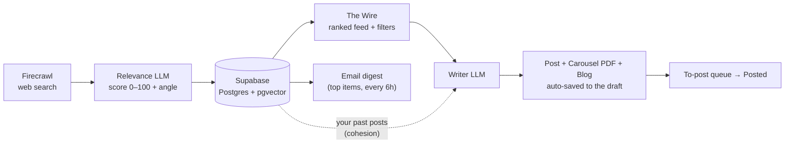

# Signal Desk

A serverless, zero-cost personal tool that watches the web for post-worthy tech
news and turns the best of it into **LinkedIn posts, swipeable carousels, and
website blog articles — written in your own voice**, grounded in what you've
already published so your feed stays cohesive and never repeats itself.

It runs entirely on free tiers: Next.js on Vercel Hobby, Supabase (Postgres +
pgvector), and a GitHub Actions cron. No always-on server, no monthly bill.

## How it works



1. **Monitor** — Firecrawl searches your topics on a schedule. A fast, cheap LLM
   scores every item 0–100 for how strong a post you could write from it, and
   suggests an angle. Each item is embedded into pgvector.
2. **Read** — items land on *The Wire*, ranked by signal, with search + score +
   topic filters. High-signal, genuinely interesting stories float to the top.
3. **Write** — pick one and the writer LLM drafts posts in your voice, retrieving
   your closest past writing (blog, case studies, prior posts) so the tone
   matches and topics don't repeat. It flags near-duplicates of things you've
   already said.
4. **Package** — from the same story, generate a **carousel** (a real swipeable
   PDF deck, not just slide text) and a **blog article** (Markdown, ready for
   your site). Everything auto-saves to the draft.
5. **Ship** — like a draft into the **To-post** queue, copy the text, download the
   PDF/`.md`, publish, and mark it posted. An optional email digest nudges you
   when strong items appear.

## Highlights

- **Voice-grounded, anti-slop writing.** Retrieval over your own corpus + a tuned
  style contract (hook within 140 chars, concrete specifics, banned AI tells).
  It writes *takes on the news*, not résumé bait.
- **Three deliverables per story**, all persisted together on one post:
  - **LinkedIn post** — several distinct takes to choose from and edit.
  - **Carousel PDF** — 1080×1350 portrait deck with **embedded brand fonts**
    (Fraunces + IBM Plex Sans), so the export doesn't look like a generic template.
  - **Blog article** — a full Markdown post (H1 + sections, ~600–1000 words) for
    your own website.
- **Cohesion memory.** pgvector similarity against past posts keeps your feed from
  repeating itself and steers the voice.
- **Auto-save + queue.** Drafts save the moment they're written; a "To-post" queue
  lines up the ones you like.
- **Email digests.** Top un-seen items ≥ a score threshold, mailed on a schedule
  via Resend, each with a tap-to-draft link.
- **Genuinely $0.** Free tiers throughout; a monitoring pass is bounded to stay
  inside the serverless time limit.

## Tech stack

| Layer | Choice |
| --- | --- |
| Framework | Next.js (App Router, RSC, Server Actions) + React 19, TypeScript |
| Data | Supabase — Postgres + `pgvector` (HNSW), RLS on, service-role only |
| Web search | Firecrawl `/search` + `/scrape` |
| Writing & scoring | Any OpenAI-compatible chat model (default: DeepSeek `deepseek-chat`) |
| Embeddings | Gemini `gemini-embedding-001` @ 1024 dims (OpenAI-compatible) |
| Carousel PDF | jsPDF with embedded TrueType fonts, rendered client-side |
| Scheduling | GitHub Actions cron → a bearer-guarded API route |
| Hosting | Vercel Hobby |

The chat provider is pluggable — point `LLM_*` at any OpenAI-compatible endpoint.
Embeddings stay on their own provider since DeepSeek has no embeddings API.

## Getting started

Prerequisites: Node 18+, and free accounts for Firecrawl, an LLM provider
(DeepSeek), Google AI Studio (embeddings), and Supabase.

```bash
npm install
cp .env.example .env.local     # then fill it in — see the comments in that file
npm run db:migrate             # applies supabase/migrations/* (needs SUPABASE_DB_URL)
node --env-file=.env.local scripts/import-voice.mjs   # load your writing into pgvector
npm run dev                    # open the local URL, sign in with APP_PASSWORD
```

Hit **Scan now** on the feed to pull the first batch. Every environment variable
is documented in [`.env.example`](.env.example); the full walkthrough — Supabase,
deploy to Vercel, and the GitHub Actions schedule — is in
**[docs/setup.md](docs/setup.md)**.

## Project structure

```
src/
  app/(app)/         Feed, Saved, Library, To-post (queue), Sources, Usage
  app/api/public/    cron/monitor — the scheduled, bearer-guarded entry point
  components/        feed, generator, carousel + blog studios, post cards
  lib/
    monitor/         one bounded monitoring pass (search → score → embed → store)
    generate/        post drafting (voice retrieval + duplicate check)
    carousel/        deck generation + jsPDF rendering + embedded fonts
    blog/            blog-article generation + Markdown helpers
    voice/           the authorial profile and voice rules
    llm/             chat + embeddings clients, prompt builders
supabase/migrations/ schema + pgvector + seed sources (numbered, idempotent)
docs/                architecture, setup, conventions, and ADRs
```

## Notes

This is a **single-user personal tool**. The "voice" it writes in is the owner's,
learned from their own corpus; to make it yours, swap in your writing via
`scripts/import-voice.mjs` and edit `src/lib/voice/profile.ts`. Access is a simple
password gate; all data access is server-side via the Supabase service-role key
(RLS is enabled with no public policies).

Architecture and design decisions live in **[docs/](docs/README.md)**.
